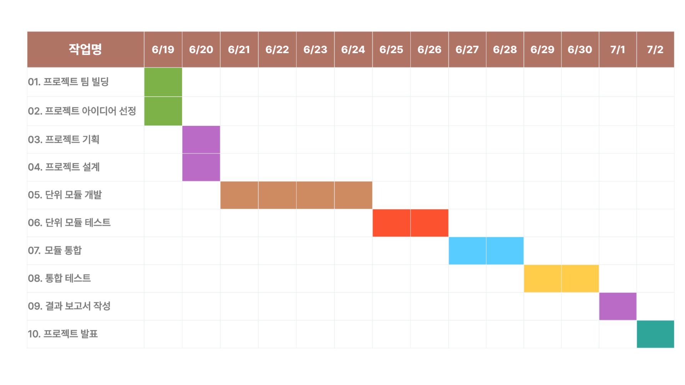

# E-Z Kiosk

누군가에게는 어려운 키오스크를 누구나 쉽게 사용하는 키오스크로

## 프로젝트명
**E-Z Kiosk**

 

# 💡 프로젝트 기대효과
1. 고령자와 장애인의 키오스크 사용 경험 개선
2. 소상공인들의 수익성 개선
3. AI 모델 개발 경험
4. UI 및 C++ 개발 경험
5. Raspberry Pi 개발 경험

 

# 📉 프로젝트 시행목적
### 1. 잘못 주문할까 겁나는 키오스크
   1. 고령자들의 디지털 접근성 개선
   2. 고령자들의 디지털 역차별 해소
   3. 소상공인 수익성 개선
### 2. 들리지도 닿지도 않는 키오스크
   1. 장애인들의 키오스크 사용성 개선
   2. 장애인들에게 정당한 편의 제공
   3. 소상공인 수익성 개선

 

# 🍔 프로젝트 개요
- 2024 Intel Edge AI SW(4기)에서 진행한 "카페 키오스크"를 구현하는 그룹 프로젝트 
- 미션 기간: `2024-06-19 ~ 2024-07-02`

 

# 🧑🏻‍💻팀원 소개
- 염재영 : 프로젝트 관리, UI디자인, Raspberry Pi 모듈 개발
- 김기범 : CV 모델 개발, LLM 모델 개발, Raslberry Pi 모듈 개발
- 조원진 : CV 모델 개발, LLM 모델 개발,  UI검증
- 정용재 : 키오스크 GUI 개발, 프로젝트 기획및 문서 작성, AI모델 검증

 

## 📃프로젝트 일정

 

# 📤 프로젝트 산출물 형태
1. [요구사항 분석서](01아이디어제안및기획단계/프로젝트기획및설계파트/03_2조_요구사항분석서.hwp)
   1. 문제 정의
   2. 타당성 조사
2. 시스템 설계서
   1. UseCase 다이어그램
   2. 시스템 흐름도
3. 시연 영상
4. 키오스크 시제품
   1. 사용자 맞춤 UI
   2. 컴퓨터 비전, LLM AI 모델
   3. Raspberry Pi 설계도

 

# 📚 프로젝트 수행절차
1. 문제 정의, 타당성 조사
2. 시스템 설계 (UI 설계, AI 모델 설계)
3. 시제품 제작 및 테스트
4. 보고서, PPT 작성

 

## 🖥️ 동작 화면

 

## 🔧️ 개발 환경
### Front-End

### Back-End

- Language : Python, C++
- Hardware : Raspberry Pi 5(8GB), CAM, Ultrasonic Sensor, ServoMotor

 

## ⚙️ 프로젝트 구조
### Use Case

### 순서도

### 사용자 인터페이스(왼쪽: 기존 GUI| 오른쪽 : 고령자 지원 GUI)

 

## 🌎 API 명세서

 

## 🗂️ WIKI 문서
