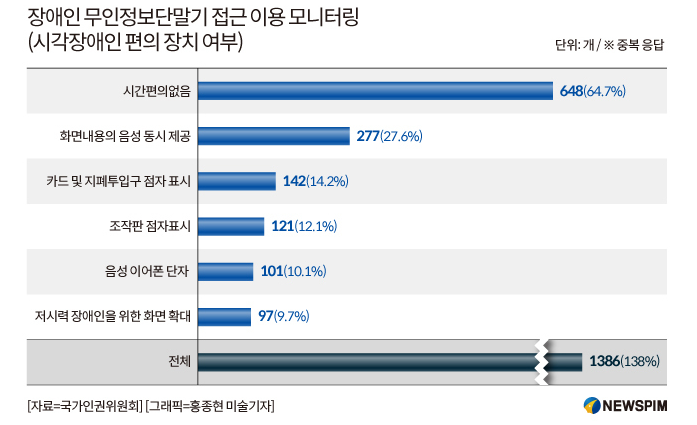
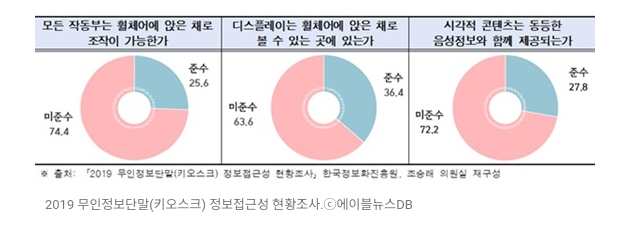
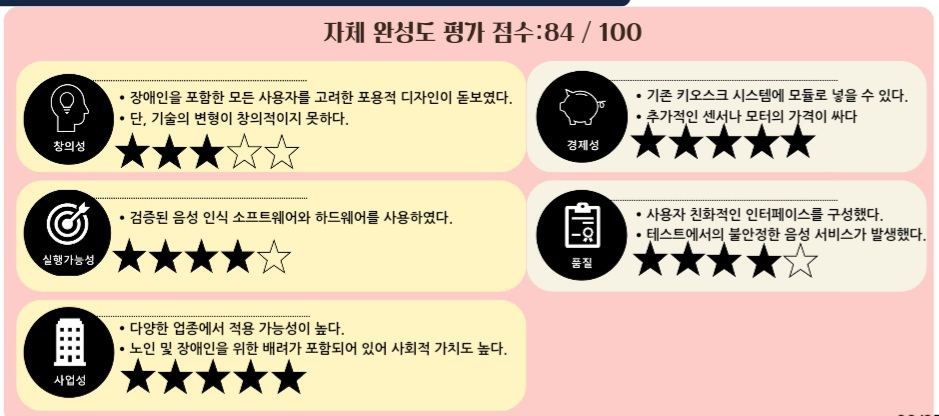
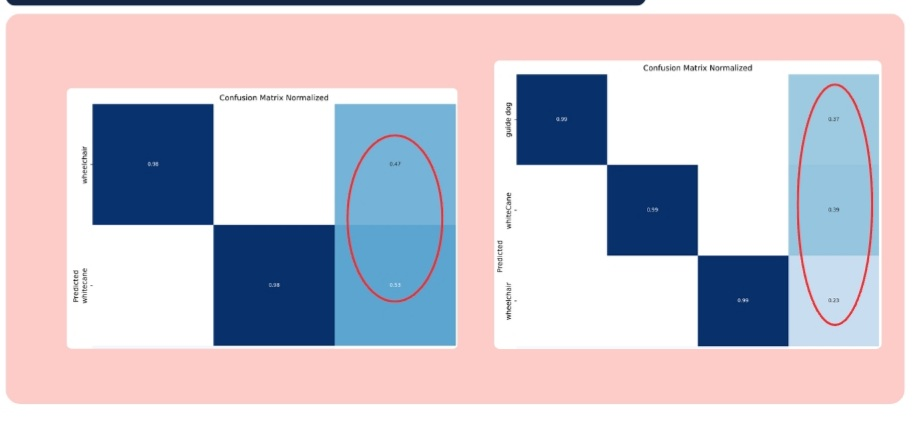
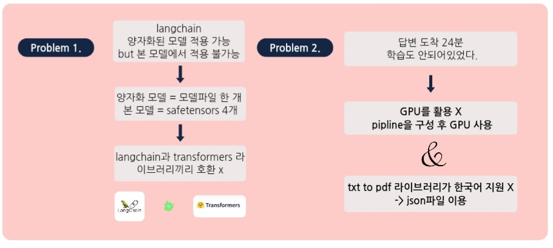
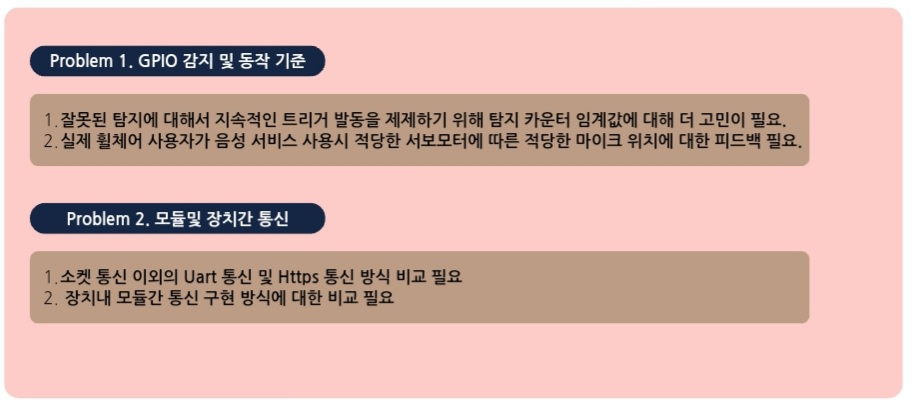
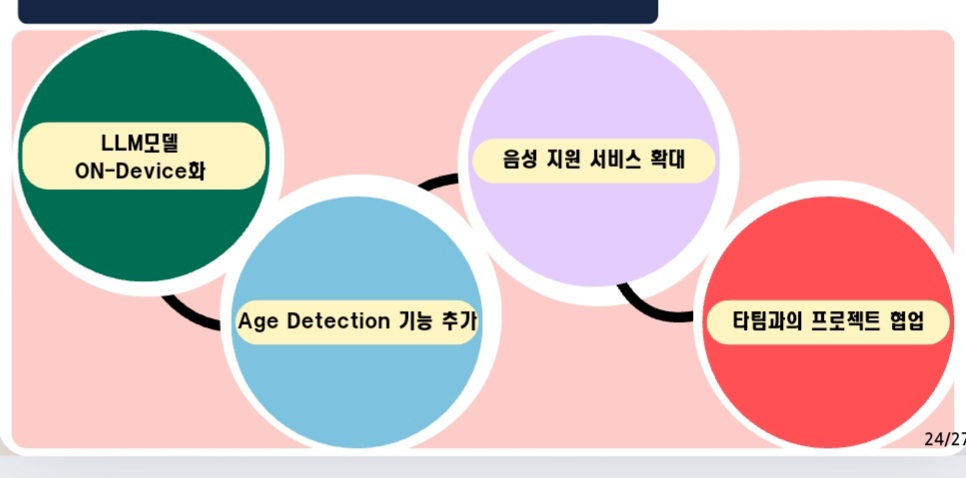

 

 

# 🎯프로젝트명

 

# 📉 프로젝트 시행목적
### 1. 잘못 주문할까 겁나는 키오스크
   1. 고령자들의 디지털 접근성 개선
   2. 고령자들의 디지털 역차별 해소
   3. 소상공인 수익성 개선
### 2. 들리지도 닿지도 않는 키오스크
   1. 장애인들의 키오스크 사용성 개선
   2. 장애인들에게 정당한 편의 제공
   3. 소상공인 수익성 개선

 

# 🍔 프로젝트 개요
## - 2024 Intel Edge AI SW(4기)에서 진행한 "카페 키오스크"를 구현하는 그룹 프로젝트 
## - 미션 기간: `2024-06-19 ~ 2024-07-02`

 

# 📰프로젝트 시장조사

- ‘내돈내산’인데 무용지물 키오스크, 시각장애인 불편 언제까지?(유튜브 뉴스영상) - https://youtu.be/vlJbVYn9a00?t=28

- 키오스크가 두려운 ‘고령층’…디지털 격차 해소 대책은? (유튜브 뉴스영상) - https://www.youtube.com/watch?v=u_UqKOiXRtA

- 키오스크 장애인 편의 제공 의무화 정부 검토(2024년04월02일) - https://www.newspim.com/news/view/20240402000175

# 💡 프로젝트 기대효과
### 🙋 사용자 친화적 인터페이스: 
- 고령자와 장애인의 신체적, 인지적 요구를 반영한 인터페이스로 사용 편의성이 높아집니다.
- 다양한 기능 제공: 의료, 금융, 공공 서비스 등 다양한 기능을 제공하여 일상 생활의 편의를 도모합니다.

###  🚩 독립성 증대: 
- 고령자와 장애인이 별도의 도움 없이 스스로 키오스크를 이용할 수 있게 되어 독립적인 생활을 영위할 수 있습니다.
- 정보 접근성 개선: 쉽게 접근할 수 있는 정보 제공으로 인해 고령자와 장애인들이 필요한 정보를 빠르게 얻을 수 있습니다.

### 🎫 디지털 소외 방지: 
- 디지털 격차를 줄이고 고령자와 장애인의 사회적 통합을 촉진합니다.
- 사회적 자원 활용: 다양한 공공 서비스와 연계하여 고령자와 장애인의 삶의 질을 향상시킵니다.

### 🏭 생산성 향상: 
- 고령자와 장애인이 보다 효율적으로 사회에 참여하게 되어 전반적인 생산성이 향상될 수 있습니다.

### 💸 비용 절감: 
- 인력 비용 절감 및 효율적인 자원 활용으로 인해 경제적 이익을 창출할 수 있습니다.

 

# 🧑🏻‍💻팀원 소개
- 염재영 : 프로젝트 관리, 시스템통신구축, Raspberry Pi 모듈 개발
- 김기범 : CV 모델 개발, LLM 모델 개발, UI검증
- 조원진 : CV 모델 개발, LLM 모델 개발, Raslberry Pi 모듈 개발 
- 정용재 : 키오스크 GUI 개발, 프로젝트 기획및 문서 작성, AI모델 검증

 

## 📃프로젝트 일정

 

# 📚 프로젝트 수행절차
1. 문제 정의, 시장 조사
2. 시스템 설계 (UI 설계, AI 모델 설계)
3. 시제품 제작 및 테스트
4. 보고서, PPT 작성

# 🔧️ 개발 환경
### Front-End

### Back-End

- Language : Python, C++
- Hardware : Raspberry Pi 5(8GB), CAM, Ultrasonic Sensor, ServoMotor

 

# ⚙️ 프로젝트 구조
### 순서도

### 전체 구조도 ver1

### 기술 스택

### 사용자 인터페이스

# 🙂프로젝트 자체 평가의견

### 📑자체 완성도 평가

### ➕프로젝트 수행 고찰

- 위에서 나와있듯이 모델학습 결과로 나온 혼동행렬로 봐서는 모델의 객체 탐지 정확도가 나쁘지 않은것으로 판단된다.

- 하지만 웹캠의 화질 성능에 따라서 객체탐지 정확도에 많은 영향을 미쳤다. 

- Langchain과 Transformers 라이브러리 간의 호환 문제:양자화된 모델 적용 가능성이 있지만, 본 프로젝트에서 사용한 모델은 safetensors 파일 4개로 구성되어 있어, 양자화 모델의 적용이 불가능했다.Langchain과 Transformers 라이브러리 간의 호환성 문제가 발생했다.

- GPU 활용 문제 및 응답 시간:LLM이 학습된 상태가 아니었고, 결과를 도출하는 데 24분이 걸린 점이 문제로 지적되었습니다.프로젝트 중에는 GPU를 활용하지 못했으나, 인텔에서 가용해준 서버환경을 이용하여 파이프라인을 구성하여 GPU 사용을 하였다.

- txt to pdf 라이브러리가 한국어를 지원하지 않아 json 파일을 이용하여 대체하였다.

### ⬆️프로젝트 향후 개발방향

#### 1. **LLM 모델 ON-Device화**:
- LLM 모델을 클라우드가 아닌 로컬 디바이스에서 직접 실행할 수 있도록 하는 것을 목표로 하고 있다. 이를 통해 실시간 반응 속도를 개선하고, 데이터 처리의 보안성을 높이는 효과를 기대할 수 있다.

#### 2. **Age Detection 기능 추가**:
- 사용자의 연령대를 인식하는 기능을 추가할 계획이다. 이는 고령자와 같은 특정 사용자 그룹에게 맞춤형 서비스를 제공하는 데 활용될 수 있다.

#### 3. **음성 지원 서비스 확대**:
- 현재 제공되고 있는 음성 지원 서비스를 더욱 확장할 계획이다. 이는 더 다양한 사용자가 접근할 수 있도록 하며, 특히 시각장애인과 같은 사용자에게 더 많은 기능을 제공할 수 있도록 설계될 것이다.

#### 4. **타팀과의 프로젝트 협업**:
- 다른 팀과의 협업을 통해 프로젝트를 확장하고, 다양한 기술적 도전과제를 함께 해결할 계획이다. 이를 통해 프로젝트의 완성도를 높이고, 더 많은 혁신적인 기능을 추가할 수 있을 것이다.

 

 

# 🌎 [시연 영상](03최종프로젝트/Documents/09_최종발표시연영상.mp4)

 

